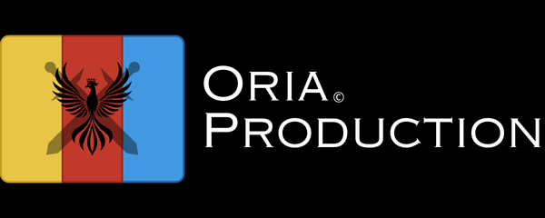

# Oria Wiki / Projet Site Web

## Sommaire
- Présentation
- Informations du projet
- Structure du REPO
- Fonctionnement des versions
- Crédits

## Présentation

  Bienvenue sur le GitHub officiel du wiki du lore d’Oria.
Ce dépôt a pour objectif d’héberger et d’organiser toutes les informations relatives au monde d’Oria, un univers d’illusions et d’infinités d’univers, imaginé par l’Illusionniste, un être réel.

  Le wiki sert de référence centrale pour le lore: il contient l’histoire, les peuples, les empires, les mystères et toutes les ressources nécessaires pour explorer et comprendre ce monde.

  Ici, vous trouverez également des informations sur le projet et ses objectifs.


## Informations du projet

  Le lore d’Oria est un projet original qui, bien que pouvant s’inspirer d’autres univers, vise à créer un monde totalement unique.

Objectifs principaux:
- Imaginer et développer un univers cohérent, riche et immersif.
- Fournir une base pour des créations futures: jeux vidéo, livres, animations, ou autres médias.
- Documenter et organiser le lore de manière claire et accessible pour tous.

Oria n’est pas seulement une histoire à lire, c’est un monde vivant, où chaque élément a sa place et contribue à l’expérience globale.


## Structure du REPO
```
Oria-Lore/
├── README.md
├── index.html
├── assets/
│   ├── main.css
│   └── main.js
├── dossiers/
│   ├── nexara/
│   │   ├── nexara.html
│   │   ├── nexara.js
│   │   └── contenu/
│   │       └── index.json
│   └── fondation_scp/
│       ├── fondation_scp.html
│       ├── fondation_scp.js
│       └── contenu/
│           └── index.json
└── images/
    ├── image_nexara/
    │   └── prehistoire/
    │       └── gigantisme-taille.png
    └── logo/
        ├── nexara-logo-cercle.png
        └── nexara-logo.png
```

## Fonctionnement des versions
Le système de versions de ce dépôt fonctionne ainsi :
*Les versions du site sont affichées sur la page d’accueil (Index / Home).*

### Version X.0.0.0
Quand X augmente, cela signifie qu’un changement majeur a été effectué sur le site.

### Version 0.X.0.0
Quand X augmente, cela indique des modifications mineures, mais tout de même importantes.

### Version 0.0.X.0
Quand X augmente, cela correspond à de petites améliorations ou ajouts.

### Version 0.0.0.X
Quand X augmente, cela représente des corrections ou des ajustements sur les modifications effectuées.


## Crédits

Projet développé par divin_hunter
Contact : mondeoria.official@gmail.com

Merci à tous ceux qui contribuent à l’évolution du lore et à la vie du monde d’Oria.



© 2025 Oria - Empire Nexara
